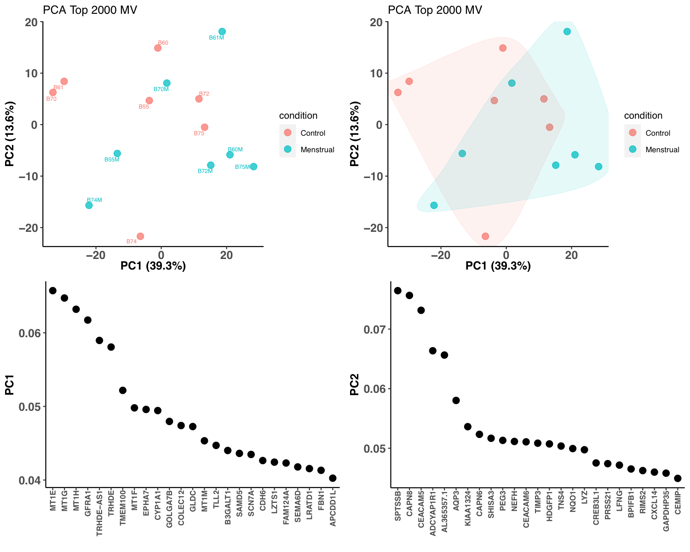
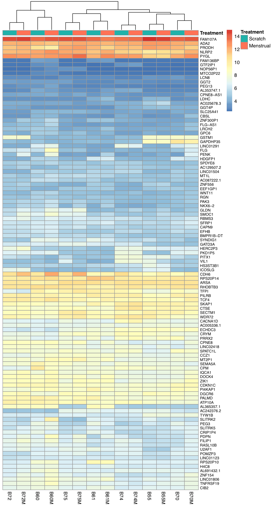
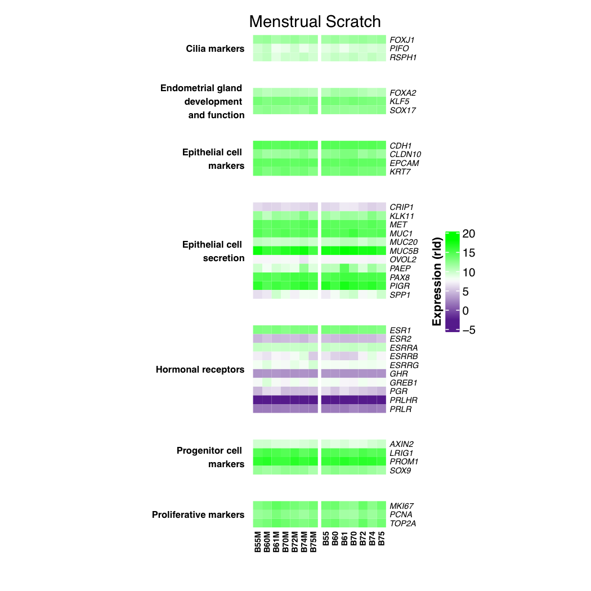

# Menstrual flow as a non-invasive source of endometrial organoids
Tereza Cindrova-Davies <sup>1,5</sup>, Xiahui Zhao<sup>1</sup>, Kay Elder<sup>2</sup>, Carolyn JP Jones<sup>3</sup>, Ashley Moffett<sup>1,4</sup>, Graham J Burton<sup>1</sup>, Margherita Y Turco<sup>1,4</sup>

<sup>1</sup> Centre  for  Trophoblast  Research,  Department  of  Physiology,  Development  and  Neuroscience,  University of Cambridge, Downing Street, Cambridge, CB2 3EG, UK <br>
<sup>2</sup>  Bourn Hall Clinic, High Street, Bourn, Cambridge, CB23 2TN, UK <br>
<sup>3</sup>  Maternal  and  Fetal  Health  Research  Centre  Division  of  Developmental  Biology  &  Medicine  School  of  Medical  Sciences  Faculty  of  Biology,  Medicine  and  Health  University  of  Manchester,  Manchester Academic Health Science Centre, St Mary's Hospital Oxford Road, Manchester M13 9WL <br>
<sup>4</sup> Department of Pathology, University of Cambridge, Tennis Court Road, Cambridge, CB2 1QP, UK <br>
**Corresponding author:** Dr Tereza Cindrova-Davies  tc269@cam.ac.uk

Code Release for this github: [](https://zenodo.org/badge/latestdoi/xx)

## Data Availability

* Microscopy Images: Original microscopy images for **Fig 1b,1c,1d,1e,1f,1h**, **Fig. 3a,3e,3f** and Supplementary Figures **SFig. 1,2,3,4** are stored in Cambridge research repository Apollo with [](https://doi.org/10.17863/CAM.68319) "Image depository for Communications Biology paper 'Menstrual flow as a non-invasive source of endometrial organoids"
* RNASeq data: EMBL-EBI ArrayExpress **E-MTAB-9284**(https://www.ebi.ac.uk/arrayexpress/experiments/E-MTAB-9284/)


## Abstract
Assessment of the endometrium often necessitates a biopsy, which currently involves an invasive,  transcervical procedure. Here, we present an alternative technique based on deriving organoids from menstrual flow.  We demonstrate that organoids can be derived from gland fragments recovered from menstrual flow. To confirm they faithfully reflect the in vivo state we compared organoids derived from paired scratch biopsies and ensuing menstrual flow from patients undergoing in-vitro fertilisation (IVF). We demonstrate that the two sets of organoids share the same transcriptome signature, derivation efficiency and proliferation rate.  Furthermore, they respond similarly to sex steroids and early-pregnancy hormones, with changes in morphology, receptor expression, and production of ‘uterine milk’ proteins that mimic those during the late-secretory  phase and early pregnancy. This technique has wide-ranging impact for non-invasive investigation and personalised approaches to treatment of common gynaecological conditions, such as endometriosis, and reproductive disorders, including failed implantation after IVF and recurrent miscarriage.
Corresponding source data and RNASeq  analysis for Endometrial organoids compare to Menstrual.

## Source data information to link the main Figs

| Files | link   | Name (Corresponding Fig)
| ----------------------------- | --- |---|
|Source data.xlsx | [[xlsx](Figures_Tables/Source data.xlsx)] | Single cell assay (**Fig. 1g**) |
|  | |Ki67 quantification (**Fig. 1i**) |
|  | |qRT-PCR datasets (**Fig. 2d**) |
|  | |Western blot data (**Fig. 2e,3c**) |
|  | | GdA ELISA (**Fig. 2g**) |


## RNASeq analysis Methods

RNA was extracted from organoids using RNeasy Plus Universal Mini Kit (catalog no. 73404; Qiagen). Libraries were made using the Illumina TruSeq Stranded mRNA Library Kit according to the 295 manufacturer’s instructions. Libraries were quantified (kappa qPCR), and equimolar pools were sequenced, using the Illumina NextSeq500 (1x75 bp, 30 Gb, 400M SE/800M PE reads). RNA-Seq, 75bp single end, libraries were generated from matched patient samples from endometrial scratch (n=7) and menstrual flow treatment (n=7). The raw sequencing data are deposited at EBI-EMBL ArrayExpress with experimental code E-MTAB-9284.  <br>

For each library, original reads files were aligned to GRCh38 human genome (Ensembl Release 84) with STAR (v2.5.1b_modified). Alignments and quality control (QC) were processed using a ClusterFlow (v0.5dev, https://github.com/ewels/clusterflow) with the “fastqc_star” pipeline. QC reports were assessed using MultiQC30 (v0.9dev), which includes output from FastQC (v0.11.5), Trim_galore (v0.6.4) and fastq_screen (version 0.9.3). Gene quantification was determined with HTSeq-Counts (v0.6.1p1). Differential gene expression analysis was performed with DESeq2 (v1.26.0) package in R (v3.6.2). Significant differentially expressed genes between Menstrual and Endometrial scratch samples were selected using the threshold for Benjamini-Hochberg (BH) adjusted p-value less than 0.05 and log2FoldChange greater than 1. <br>

Initial quality control prior to calculating differential expression was by principal component analysis (PCA). The PCA plot was generated by using the log2 transformation on the raw count data from DESeq2 with the rlogTransformation function with option “blind=F”. Then the top 2000 most variables genes were selected to perform the PCA analysis (Fig. 2a). Based on the PCA plot, the endometrial scratch and the menstrual blood samples did not form distinct clusters; therefore, a small number of differential expressed genes (DEGs) were identified. Only 101 genes passed the threshold settings with padj < 0.05 and absolute log2FoldChange greater than 1 (equivalent to a 2-fold change). Fig. 2b shows these 101 DEGs with the log2 transformed counts for each patient sample as a heatmap, with sample clustering. For each individual patient the endometrial scratch and menstrual blood are clustered together. Seven sets of marker genes for menstrual flow rganoids are visualised as a heatmap in Fig. 2c using the same log2 transformed counts. <br>


### Step 1: Get the samples information

  **Sample_information_Table** [[txt](Figures_Tables/CTR_gjb2_0010-Control_Menstrual_SampleTable.txt)]

## Step 2: QC and Alignment pipeline
 - Sequencing Data Quality Control (FastQC, v0.11.5), Adapter trimming (Trim_galore, v0.6.4) and alignments processed using ClusterFlow [[GitHub](https://github.com/ewels/clusterflow)] [[DOI](http://dx.doi.org/10.12688/f1000research.10335.2)] with pipeline "fastq_star". Raw reads were aligned to human genome GRCh38 (Ensemble release 84) with STAR (v2.5.1b_modified);

         eg.  cf --genome GRCh38 --single fastq_star B61_S5_R1_001_merged.fastq.gz

 - Sequencing Data report summary using MultiQC(v.1.4);
 - Gene counts were used HTSeq-Counts (v0.6.1p1)

## Step 3: Differential Analysis using R (v3.6.2) with DESeq2 (v1.26.0)

                              Design formula ~ individual + condition
The analysis code is
DESeq_Analysis_Rcode[[R](CTR_gjb2_0010_Menstrual_Control_DESeq_Analysis.R)]


Corresponding results are given below

| Fig/Tab | Link   | Images |Legend |
| ----------------------------- | --- |----|----|
|Fig. 2a | [[PDF](Figures_Tables/CTR_gjb2_0010-PCAplot_rld.menstrual_TopN2000.pdf)] || PCA plot for the Top 2000 MVs between the menstrual and scratch comparison |
|Fig. 2b | [[PDF](Figures_Tables/CTR_gjb2_0010-Heatmap_Control_Menstrual_padj0.05_lfc1_top101.pdf)] ||  Heatmap clustering plot for the 101 DEGs identified|
|Fig. 2c | [[PDF](Figures_Tables/CTR_gjb2_0010-Heatmap_endometrial_Menstrual_stemcell_N38_Cat7_ord.pdf)] ||  Heatmap for selected markers with interested function|
|Data-Fig. 2b | [[CSV](Figures_Tables/CTR_gjb2_0010-Menstrual_Control_sigDEGs_N101_List.csv)] || spreadsheet for the 101 DEGs|
|Data-Fig. 2c|[[XLS](Figures_Tables/Menstrual_StemCell_markers.xls)]| | list for selected markers|


## Software R Versions & Methods

````
R version 3.6.2 (2019-12-12)
Platform: x86_64-apple-darwin15.6.0 (64-bit)
Running under: macOS  10.14.4

Platform: x86_64-pc-linux-gnu (64-bit)
Running under: Ubuntu 16.04.6 LTS

Matrix products: default
BLAS:   /storage/Software/packages/R-3.6.2/lib/libRblas.so
LAPACK: /storage/Software/packages/R-3.6.2/lib/libRlapack.so

Random number generation:
 RNG:     Mersenne-Twister
 Normal:  Inversion
 Sample:  Rounding

locale:
 [1] LC_CTYPE=en_GB.UTF-8       LC_NUMERIC=C              
 [3] LC_TIME=en_GB.UTF-8        LC_COLLATE=en_GB.UTF-8    
 [5] LC_MONETARY=en_GB.UTF-8    LC_MESSAGES=en_GB.UTF-8   
 [7] LC_PAPER=en_GB.UTF-8       LC_NAME=C                 
 [9] LC_ADDRESS=C               LC_TELEPHONE=C            
[11] LC_MEASUREMENT=en_GB.UTF-8 LC_IDENTIFICATION=C       

attached base packages:
[1] stats     graphics  grDevices utils     datasets  methods   base     

other attached packages:
 [1] ComplexHeatmap_2.5.1        apeglm_1.8.0               
 [3] limma_3.42.2                ggalt_0.4.0                
 [5] dplyr_0.8.5                 plyr_1.8.6                 
 [7] biomaRt_2.42.1              reshape2_1.4.4             
 [9] ggrepel_0.8.2               pheatmap_1.0.12            
[11] cowplot_1.0.0               RColorBrewer_1.1-2         
[13] ggplot2_3.3.0               DESeq2_1.26.0              
[15] SummarizedExperiment_1.16.1 DelayedArray_0.12.3        
[17] BiocParallel_1.20.1         matrixStats_0.56.0         
[19] Biobase_2.46.0              GenomicRanges_1.38.0       
[21] GenomeInfoDb_1.22.1         IRanges_2.20.2             
[23] S4Vectors_0.24.4            BiocGenerics_0.32.0    
.....           
````

## Contact

Contact Xiaohui Zhao (xz289 -at- cam.ac.uk)
